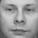
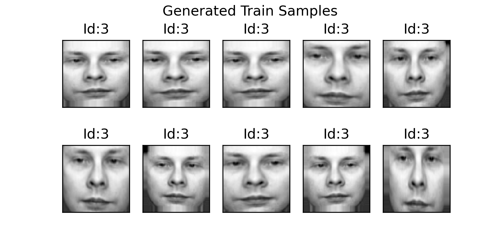
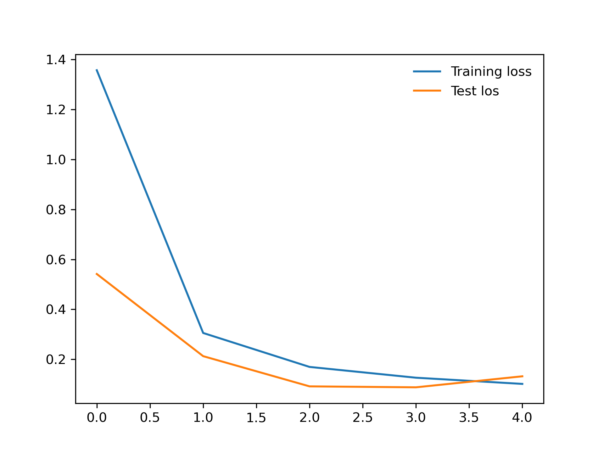

[](https://opensource.org/licenses/MIT)
[](https://pytorch.org/)
[](https://keras.io/)
[](https://www.python.org/)
[](https://numpy.org/)
[](https://www.jetbrains.com/pycharm/)

# Olivetti - CNN

To run:

`python -W ignore olivetti.py --write-to-file True --generate-data True`

 The test-set accuracy should be close to the 97%.
 
 ## Steps
 
### 1. The dataset is divided into the 65% - 35% ratio.

We have 400 samples; 260 training images and 140 test images.

If we train the model on 260 images the maximum accuracy will be 5%.

`python -W ignore olivetti.py --write-to-file True`

### 2- Generate images 

We will have two types of image generator: train and test

```python
train_data_gen = ImageDataGenerator(rescale=1./255, shear_range=0.2, zoom_range=0.2, horizontal_flip=True)
```

So what does it mean?

From a selected sample:



10 samples generated based on the shearing, zoom and horizontal flip:


   
### 3. Train and Test Loss (After 5 epoch)

 


## Contributing :thought_balloon:
Pull requests are welcome.

For major changes, please open an issue, then discuss what you would like to change.

 ## License :scroll:
[MIT](https://opensource.org/licenses/MIT)
